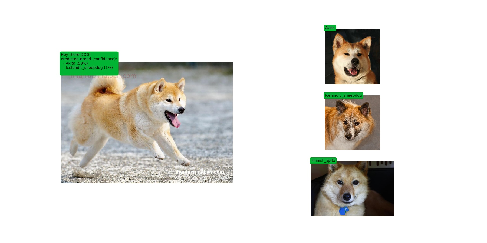
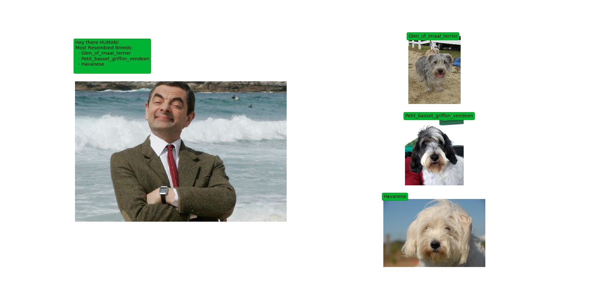
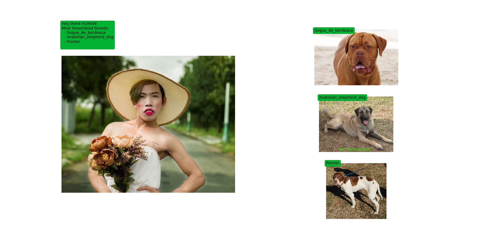

# Dog Breed Prediction 
[](https://github.com/DucLeTrong/dog_breed_classification)

## About data set
The dog breed dataset consists of 133 different breeds
- [Data](https://s3-us-west-1.amazonaws.com/udacity-aind/dog-project/dogImages.zip)

- Download data and unzip:
```
$ wget https://s3-us-west-1.amazonaws.com/udacity-aind/dog-project/dogImages.zip

$ unzip dogImages.zip
```


## Training
- Clone project
```
$ git clone https://github.com/DucLeTrong/dog_breed_classification

$ cd dog_breed_classification
```

- Install requirements
```
$ pip3 install -r requirements.txt
```

- Train model 
```
$ python3 train.py 
```

## Test model 
```
$ python3 test.py 
```

## Inference
```
$ python3 infer.py --img_path='2.jpg' --model_path='model.pt'
```
- if a __dog__ is detected in the image, return the predicted breed.



- if a __human__ is detected in the image, return the resembling dog breed.





- if __neither__ is detected in the image, provide output that indicates an error.


